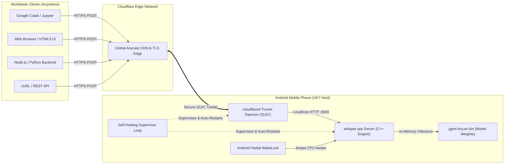

# 📱 PhoneWhisper AI — Headless Mobile AI Inference Server & Universal Clients

<div align="center">


-F38020.svg?logo=cloudflare)


**Turn any old or spare Android phone into a 24/7 self-healing, worldwide accessible OpenAI-compatible Whisper speech-to-text AI server with zero hosting costs.**

[Live Demo Web App](#-live-web-client) • [Architecture](#-architecture) • [Python Client](#-python-client) • [JavaScript / Node Client](#-javascript--nodejs-client) • [Phone Setup Guide](#-turn-your-phone-into-a-server)

</div>

---

## 🌟 Highlights

* **Zero Cloud Costs**: Runs 100% on-device on mobile phone CPU/RAM via optimized C++ GGML quantization.
* **Global Access (Dual-Stack IPv4/IPv6)**: Seamlessly accessible worldwide through encrypted Cloudflare edge tunnels with automatic TLS termination.
* **100% 24/7 Background Uptime**: Survives screen off, deep sleep, and power disconnects using Android wakelocks, Doze whitelisting, and self-healing watchdog loops.
* **Universal Multi-Platform Clients**: Ready-to-use drop-in clients for Python, JavaScript (Node & Browser), cURL, and a full standalone Web App.
* **Compatible with Standard Tools**: Send audio from Google Colab, AWS Lambda, Jupyter notebooks, web browsers, or mobile apps.

---

## 🏗️ Architecture



---

## 🚀 Quick Start & Usage

### 🐍 Python Client

Works on Windows, macOS, Linux, Google Colab, and cloud servers.

#### Installation
```bash
pip install requests
```

#### Command-Line Usage
```bash
# Transcribe any audio file (WAV, MP3, OGG, M4A)
python3 transcribe.py your_audio.wav

# Output as plain text
python3 transcribe.py your_audio.wav --format text

# Point to custom endpoint
python3 transcribe.py your_audio.wav --endpoint "https://<your-subdomain>.trycloudflare.com/inference"
```

#### In Your Python Code (Colab, Jupyter, App)
```python
from transcribe import transcribe

# Transcribe file
result = transcribe("recording.wav")
print("Transcription:", result["text"])

# Customize format: 'json', 'text', 'verbose_json', 'srt', 'vtt'
srt_subtitles = transcribe("podcast.mp3", response_format="srt")
print(srt_subtitles)
```

---

### 🌐 JavaScript / Node.js Client

Zero external dependencies — works natively in Node.js (v18+), React, Vue, Next.js, and Vanilla JavaScript.

#### Command-Line Usage (Node.js)
```bash
node transcribe.js your_audio.wav
node transcribe.js your_audio.wav --format text
```

#### In Node.js / Express Backend
```javascript
const { transcribe } = require('./transcribe.js');

async function main() {
  const result = await transcribe('sample.wav');
  console.log('Transcription:', result.text);
}
main();
```

#### In Browser / Frontend (React / HTML5)
```javascript
import { transcribe } from './transcribe.js';

// From an <input type="file"> or recorded audio Blob
async function onAudioCaptured(audioBlob) {
  const result = await transcribe(audioBlob);
  console.log('Transcription:', result.text);
}
```

---

### 💻 cURL / REST API

```bash
curl -X POST "https://<your-subdomain>.trycloudflare.com/inference" \
  -H "Content-Type: multipart/form-data" \
  -F "file=@sample.wav" \
  -F "temperature=0.0" \
  -F "response_format=json"
```

---

### 🎙️ Standalone Web Client (`index.html`)

Open `index.html` in any web browser to get a complete UI with:
* **One-Click Microphone Recording**
* **Drag-and-Drop Audio Upload**
* **Instant Transcription with Live Feedback**
* **Copy to Clipboard Button**

```bash
# Quick local test
python3 -m http.server 3000
# Open http://localhost:3000
```

---

## 📱 Turn Your Phone Into a Server (Setup Guide)

### Prerequisites on Phone
1. Install **[Termux](https://github.com/termux/termux-app/releases)** on your Android device.
2. In Android Settings:
   * **Battery Saver**: Set Termux to **"No restrictions"**.
   * **Autostart**: Enable for Termux.

### One-Command Automated Setup
Inside Termux, run:
```bash
pkg update && pkg install -y git clang cmake cloudflared tmux daemonize
git clone --recursive https://github.com/ggerganov/whisper.cpp
cd whisper.cpp
cmake -B build
cmake --build build --config Release -j4
bash ./models/download-ggml-model.sh tiny.en
```

### Start 24/7 Daemon
Run the supervisor script:
```bash
bash mobile/start_ai.sh
```

### Management Shortcuts (inside Termux)
| Command | Description |
| :--- | :--- |
| `ai-status` | Check live server & tunnel status |
| `ai-url` | Display current worldwide HTTPS endpoint |
| `ai-logs` | Live stream inference logs |
| `ai-stop` | Stop all background AI services |
| `ai-start` | Start 24/7 background AI services |

---

## 📁 Repository Structure

```text
├── index.html        # Responsive Web Client UI (Mic recorder & file upload)
├── transcribe.py     # Universal Python Client (CLI & Module)
├── transcribe.js     # Universal JavaScript / Node.js / Browser Client
├── mobile/           # Phone-side Termux deployment & watchdog scripts
│   ├── start_ai.sh   # 24/7 Supervisor daemon with auto-recovery
│   ├── status_ai.sh  # Real-time health and URL checker
│   └── stop_ai.sh    # Graceful shutdown script
├── .gitignore        # Standard ignore rules
└── README.md         # Documentation & Architecture
```

---

## 📄 License

MIT License. Free for open-source, personal, and commercial projects.
