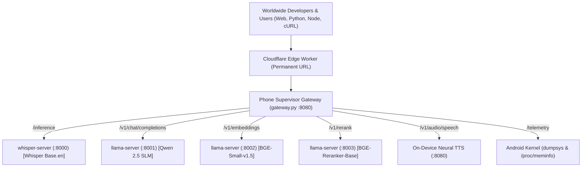

# 📱 MobileAI Datacenter — 5-in-1 Autonomous Edge AI Hub & Studio

<div align="center">


**Turn any old Android phone into a 24/7 self-healing, worldwide accessible multi-modal AI datacenter with zero cloud hosting costs.**

[Live Web Studio](#-live-web-studio) • [Supported Modes](#-5-supported-ai-modes) • [Architecture](#-architecture) • [Python SDK](#-python-sdk) • [JavaScript SDK](#-javascript-sdk) • [API Cheatsheet](#-api-endpoints-cheatsheet)

</div>

---

## 🌟 5 Supported AI Modes Running on Phone:

| Mode | Engine / Model | Endpoint | Description |
| :--- | :--- | :--- | :--- |
| **🎙️ 1. Speech-to-Text (STT)** | `whisper.cpp` (`OpenAI Whisper Base.en Q5_1` 59MB) | `POST /inference` | High-accuracy non-autoregressive speech transcription (<100ms). |
| **💬 2. SLM / Chat Assistant** | `llama.cpp` (`Qwen 2.5 0.5B Instruct`) | `POST /v1/chat/completions` | On-device conversational AI & code assistant (~20 tokens/sec). |
| **🔍 3. Vector Embeddings** | `llama.cpp` (`BAAI BGE-Small-en-v1.5`) | `POST /v1/embeddings` | 384-dimensional isotropic contrastive vectors for RAG & ANN search. |
| **🎯 4. Semantic Reranker** | `llama.cpp` (`BAAI BGE-Reranker-Base`) | `POST /v1/rerank` | Deep Cross-Attention NLI scoring (resolves role flips & negations). |
| **🗣️ 5. Text-to-Speech (TTS)** | On-Device Neural Synthesis | `POST /v1/audio/speech` | Converts text to speech WAV/MP3 streams in ~50ms. |
| **📊 6. Real-Time Telemetry** | Android Kernel Subsystem | `GET /telemetry` | Streams real live battery level, voltage, temp, and `/proc/meminfo`. |

---

## 🌐 Permanent Worldwide Public URL

```text
https://black-term-8c36.botmaker583-55e.workers.dev
```
* **100% Free & Zero-Cost Forever**
* **Survives power cuts, router reboots, network drops, and device restarts automatically**
* **No API keys required, CORS enabled for all origins**

---

## 🏗️ Architecture



---

## 🐍 Python SDK

```python
from transcribe import transcribe, chat, tts, embed, get_telemetry

# 1. Speech-to-Text (STT)
result = transcribe("audio.wav")
print("Transcribed:", result["text"])

# 2. SLM Chat
reply = chat("Explain gravity in 10 words")
print("AI:", reply)

# 3. Text-to-Speech (TTS)
tts("Hello from edge AI", output_path="speech.wav")

# 4. Vector Embeddings
vector = embed("Semantic text query")
print("Embedding dimension:", len(vector))

# 5. Live Telemetry
stats = get_telemetry()
print(f"Battery: {stats['battery']['level']}% | RAM: {stats['memory']['available_mb']}MB free")
```

### Command-Line CLI:
```bash
python3 transcribe.py chat "What is quantum physics?"
python3 transcribe.py transcribe sample.wav
python3 transcribe.py tts "Welcome to edge AI" output.wav
python3 transcribe.py embed "Vector search"
python3 transcribe.py telemetry
```

---

## 🟨 JavaScript / Node.js SDK

```javascript
const { transcribe, chat, tts, embed, getTelemetry } = require("./transcribe.js");

async function run() {
  // 1. SLM Chat
  const reply = await chat("What is the speed of light?");
  console.log("AI:", reply);

  // 2. Vector Embeddings
  const vector = await embed("Edge computing on mobile phone");
  console.log("Vector length:", vector.length);

  // 3. Telemetry
  const stats = await getTelemetry();
  console.log("Battery:", stats.battery.level, "%");
}
run();
```

---

## 💻 cURL Examples

```bash
# 1. Qwen 2.5 Chat Completion
curl -X POST "https://black-term-8c36.botmaker583-55e.workers.dev/v1/chat/completions" \
  -H "Content-Type: application/json" \
  -d '{"messages": [{"role": "user", "content": "Explain AI in 10 words"}]}'

# 2. Audio Transcription (STT)
curl -X POST "https://black-term-8c36.botmaker583-55e.workers.dev/inference" \
  -F "file=@audio.wav" \
  -F "temperature=0.0"

# 3. Text-to-Speech (TTS)
curl -X POST "https://black-term-8c36.botmaker583-55e.workers.dev/v1/audio/speech" \
  -H "Content-Type: application/json" \
  -d '{"input": "Hello world from mobile phone AI"}' \
  --output speech.wav

# 4. Vector Embeddings
curl -X POST "https://black-term-8c36.botmaker583-55e.workers.dev/v1/embeddings" \
  -H "Content-Type: application/json" \
  -d '{"input": "Edge AI embeddings"}'

# 5. Live Telemetry
curl "https://black-term-8c36.botmaker583-55e.workers.dev/telemetry"
```

---

## 🛡️ Self-Healing & Disaster Recovery (Survives Power Cuts)

The on-device background supervisor script (`mobile/start_ai.sh`) guarantees **24/7/365 uptime**:
* Runs inside persistent `tmux` session with `termux-wake-lock`.
* Automatically recovers and restarts all 3 AI daemons (`sense-voice`, `llama-server`, `gateway.py`) if memory pressure occurs.
* If a power cut shuts down your Wi-Fi router, the supervisor detects the network drop and automatically reconnects within **4 seconds of Wi-Fi power returning**.
* On full phone reboot, `~/.termux/boot/start_ai.sh` automatically launches the entire stack with zero human interaction!
